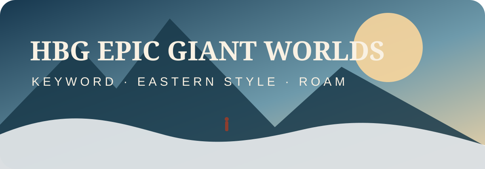
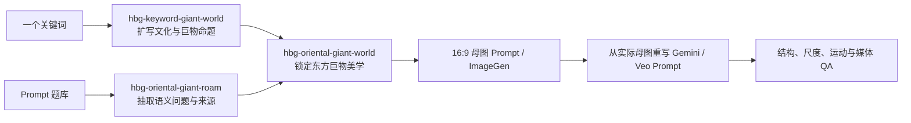

<p align="center">
  
</p>

<p align="center">
  <a href="https://github.com/Mr-funny/hbg-epic-giant-worlds/actions/workflows/ci.yml"></a>
  
  
  
  
  
  
</p>

<p align="center">
  把一个<strong>国家、宗教、文明、地点、动作或抽象关键词</strong>扩写成可信的巨物世界，<br />
  再稳定转换成<strong>明亮、空灵、祥瑞、电影写实的东方巨物图片与视频语言</strong>。<br />
  <strong>关键词扩写 · 东方风格锁 · 漫游题库 · 母图 Prompt · 图生视频 Prompt · 视角去模板化</strong>
</p>

## ⚡ 一句话安装进 Agent

把下面整段话直接发给 Codex、Claude Code，或其他支持 `SKILL.md` 的 Agent：

```text
请从 https://github.com/Mr-funny/hbg-epic-giant-worlds 安装这三个 skills：
hbg-keyword-giant-world
hbg-oriental-giant-world
hbg-oriental-giant-roam

请自动识别当前 Agent 的全局 skills 目录；如果已有旧版本，先备份再更新。
安装后检查每个 SKILL.md、agents、assets、references 和 scripts 是否完整，
并运行仓库的验证脚本与漫游固定种子测试。

不要读取、打印、复制、提交或上传我的本地账号凭据、私有 Prompt 题库、
生成图片、视频、会话日志或其他用户素材。

验证完成后，告诉我如何输入一个关键词生成巨物方案、如何东方化一个现有 Prompt，
以及如何使用 $hbg-oriental-giant-roam 进行四题漫游。
```

也可以手动安装：

```bash
git clone https://github.com/Mr-funny/hbg-epic-giant-worlds.git
cd hbg-epic-giant-worlds
./install.sh
```

## 🎯 它解决的不是“多写几个宏大形容词”，而是“建立可复用的巨物世界导演系统”

| 常见问题 | Skill 的处理方式 |
|---|---|
| 输入只有“泰国”“印度教”“弹琴”，不知道怎么扩写 | 先分类关键词，再组装文化、地貌、动作、材料、巨构和光线 |
| 每张所谓巨物图都有一棵树 | 强制轮换建筑、地貌、水、雕塑、开放前景与植物六类前景 |
| 只有仰视，巨物永远被裁掉顶部 | 支持贴地、平视、斜俯视、保留地平线鸟瞰和近垂直俯拍 |
| 四张图只是同一构图换皮 | 相邻镜头至少改变前景、机位、主体位置、引导线中的三项 |
| 天空、地球、月球一加就变成通用科幻 | 每张最多一个宇宙锚点，文化空间必须仍然占主导 |
| 东方化等于全部换成白玉天宫 | 固定的是光、空间、材质和节奏；泰国、印尼、印度教仍保留本地身份 |
| 参考图质量很好，但生成结果总复制圆门和中轴线 | 参考防火墙只允许继承材质、光线、空气感和节奏，不自动继承构图 |
| 生图 Prompt 直接拿去做视频 | 视频 Prompt 必须从实际母图重写，锁定可见结构与光线 |
| 视频一动，建筑、神像和人物一起变形 | 一种主运镜、一类环境运动、一个微小人物动作、严格刚性锚点 |
| 想漫游 Prompt 学习，却把来源风格也带进成片 | 题库只提供语义问题，统一重写成 HBG 东方巨物 Style Lock |
| 漫游只看摘要，学不到原 Prompt 的完整空间关系 | 默认直接抽取 475 条公开原文，并保留作者、来源 URL 与内容哈希 |

> [!IMPORTANT]
> “风格固定”不等于“构图固定”。这组三个 Skill 最重要的门禁，就是同时保持系列视觉 DNA 和镜头多样性。

## 🧭 三路 Skill

| Skill | 输入 | 输出 | 适合场景 |
|---|---|---|---|
| `$hbg-keyword-giant-world` | 一个国家、宗教、文明、地点、动作、物件或概念 | 概念卡、巨物母图 Prompt、图生视频 Prompt、多镜头变化表 | 从零扩写世界 |
| `$hbg-oriental-giant-world` | 关键词、粗略想法、现有 Prompt、参考图或参考视频 | 东方巨物适配卡、统一风格母图与 Veo 语言 | 把题材稳定转换为目标东方美学 |
| `$hbg-oriental-giant-roam` | 475 条公开原文、随机种子、主题、来源或自定义 JSONL 题库 | 可复现抽题、原文与来源记录、语义核、东方巨物改写 | 漫游、学习、连续找灵感 |

三个 Skill 可以独立使用，也可以串起来：



## 🚀 快速开始

### 1. 输入国家或宗教，扩写通用巨物世界

```text
使用 $hbg-keyword-giant-world 处理“印度尼西亚”。
先给我四境概念卡，四张都要是16:9超广角，但分别使用贴地低机位、平视、斜俯视和高空鸟瞰。
不要连续使用树木框景。每张最多一个天空、月球或行星尺度锚点。
然后给出四张母图 Prompt 和对应的 Veo 图生视频运动方案。
```

### 2. 把已有想法转换成东方巨物美学

```text
使用 $hbg-oriental-giant-world 把“弹琴”转换为东方巨物场景。
保留弹琴这个动作，但不要沿用圆门、中央轴线和中央人物构图。
我要明亮空灵、蓝白空气、温润材质、微小人物和一个荒诞尺度巨构。
先输出适配卡、母图 Prompt 和暂定运镜；生成母图后再按实际画面重写 Veo Prompt。
```

### 3. 随机漫游四个题目

```text
使用 $hbg-oriental-giant-roam，以 seed 2026 随机漫游四题。
把题库当成问题来源，不要继承原 Prompt 的风格和构图。
四题都转换成统一的 HBG 东方巨物风格，并确保四种机位、四类前景和四条不同运镜。
以学习模式展示：来源、语义核、保留什么、丢弃什么、最终母图 Prompt 和视频方案。
```

### 4. 直接运行漫游抽题脚本

默认直接从仓库内置的 475 条公开 Prompt 原文中抽题：

```bash
python3 skills/hbg-oriental-giant-roam/scripts/roam_prompts.py \
  --count 4 \
  --seed 2026 \
  --format markdown
```

按主题筛选：

```bash
python3 skills/hbg-oriental-giant-roam/scripts/roam_prompts.py \
  --theme "waterfall" \
  --count 2 \
  --seed 42 \
  --format json
```

如果只想使用 24 条 HBG 原创抽象机制题卡：

```bash
python3 skills/hbg-oriental-giant-roam/scripts/roam_prompts.py \
  --bank skills/hbg-oriental-giant-roam/assets/prompt-bank.jsonl \
  --count 4 \
  --seed 2026 \
  --format markdown
```

也可以导入自己的 JSONL：

```bash
python3 skills/hbg-oriental-giant-roam/scripts/roam_prompts.py \
  --bank /absolute/path/to/local-prompt-bank.jsonl \
  --count 4 \
  --seed 2026 \
  --history ./roam-history.jsonl \
  --record-history ./roam-history.jsonl \
  --format markdown
```

## ✨ 核心能力

| 模块 | 能力 |
|---|---|
| 关键词判断 | 国家、宗教、文明、城市、神话、动作、物件、抽象概念分类 |
| 文化扩写 | 地貌、建筑、工艺、纹样、人物行为、精神内核与禁忌 |
| 巨物构图 | 前中后景、微小人物、单一主巨构、负空间和尺度锚点 |
| 宇宙反差 | 云层地平线、地球弧面、巨月、巨日、日食、行星地平线 |
| 视角泛化 | 低机位、平视、斜俯视、鸟瞰、近垂直俯拍 |
| 反模板 | 不默认树、不默认圆门、不默认中轴线、不默认右下平台 |
| 东方 Style Lock | 明亮空灵、祥瑞克制、蓝白空气、温润材质、暖金自然光 |
| 地域保护 | 东方化不抹除泰国、印尼、印度教、佛教等本地视觉身份 |
| 参考防火墙 | 只提取材质、光、空气感与节奏，不复制构图骨架 |
| 漫游题库 | 随机、主题、来源、机制筛选，固定 seed，历史去重 |
| 来源管理 | 原文、来源 URL、作者、哈希与适配版分层保存 |
| 图生视频 | 从实际母图锁定结构，独立设计运镜、视差与环境运动 |
| 多镜头拼接 | 四境共享材质与色彩 DNA，独立生成、验收后再拼接 |

## 🏛️ 东方巨物 Style Lock

默认目标不是黑暗、压迫、末日，而是：

- 明亮、空灵、祥瑞、庄严、遥远、令人向往；
- 清晰蓝白空气与层层雾霭；
- 象牙石、浅玉、古木、朱红、古铜、克制淡金和地域材料；
- 真实空气透视、自然体积光和电影写实材质；
- 一个近处可读的文化锚点、微小人物、一个主巨构、大面积环境留白；
- 慢速稳定运镜，前景视差明显，远景巨构近乎不动。

如果题材是泰国、印度尼西亚或印度教，Skill 不会把它们全部改成中国天宫。东方 Style Lock 负责统一画面的呼吸、尺度、光色、材质和运动节奏；建筑、信仰、服饰与生态仍然服从题材本身。

## 🎥 为什么图片 Prompt 和视频 Prompt 必须分开

图片 Prompt 回答：世界里有什么、怎样构图、什么材质、什么光。

视频 Prompt 回答：现有画面里什么能动、什么必须不动、镜头从哪里到哪里、前中后景如何产生视差。

默认视频约束：

```text
一个连续镜头
一种主运镜
一类环境运动
一个微小人物动作
远景巨构保持刚性
不增生建筑、不复制人物、不改变天体、不切镜、不快速环绕
```

如果母图还没有生成，Skill 只能提供“暂定运动方案”，不能假装已经写出了基于实际图片的最终 Veo Prompt。

## 🗂️ 公开原文题库与版权边界

仓库直接公开 475 条东方巨物 Prompt 原文，默认漫游命令会从这套题库抽题。原文保留 `post_url`、`author` 和 `content_hash`，让学习、对比、改写和溯源都基于真实来源，而不是只看经过压缩的摘要。

同时保留 24 条 HBG 原创“视觉机制题卡”，供只想研究尺度机制、不想读取长篇来源文本时选用。

第三方 Prompt 不会被改名成 HBG 原创内容，也不纳入仓库的 MIT 授权。原作者与来源信息、权利边界和纠错/下架入口见 [THIRD_PARTY_PROMPTS.md](THIRD_PARTY_PROMPTS.md)。用户另外导入的私有题库仍然不会被 Skill 自动上传或提交。

## 📁 项目结构

```text
hbg-epic-giant-worlds/
├── .codex-plugin/plugin.json
├── skills/
│   ├── hbg-keyword-giant-world/
│   │   ├── SKILL.md
│   │   ├── agents/openai.yaml
│   │   └── references/
│   ├── hbg-oriental-giant-world/
│   │   ├── SKILL.md
│   │   ├── agents/openai.yaml
│   │   └── references/
│   └── hbg-oriental-giant-roam/
│       ├── SKILL.md
│       ├── agents/openai.yaml
│       ├── references/
│       ├── assets/public-eastern-giant-prompts.jsonl
│       ├── assets/prompt-bank.jsonl
│       └── scripts/roam_prompts.py
├── THIRD_PARTY_PROMPTS.md
├── docs/article.md
├── examples/
├── scripts/validate_repo.py
├── scripts/package.sh
├── install.sh
└── LICENSE
```

## ✅ 验证与打包

```bash
python3 scripts/validate_repo.py
python3 -m py_compile skills/hbg-oriental-giant-roam/scripts/roam_prompts.py
bash -n install.sh scripts/package.sh
./scripts/package.sh
```

仓库还会通过 CI 检查三个 Skill 的必需文件、插件清单、题库 JSONL、漫游固定种子运行、Python 语法和 Shell 语法。

## 环境要求

- 支持 `SKILL.md` 的 Agent 环境；
- Python 3.10+，仅漫游脚本需要，且只使用标准库；
- 若实际生图，需要 Agent 可调用的图像生成能力；
- 若实际做视频，需要 Gemini/Veo、Flow/Veo 或其他可用 I2V 后端；
- 若交付最终视频，建议安装 FFmpeg / ffprobe 做编码和抽帧 QA。

Skill 本身不包含模型额度、不绕过登录、不代替用户授权，也不会把本地题库自动上传到任何平台。

## 进一步阅读

- [长文：为了让一个镜头真正恢宏，我做了东方巨物、关键词扩展和近 500 条 Prompt 漫游](docs/article.md)
- [关键词巨物示例](examples/keyword-iceland.md)
- [东方化示例](examples/oriental-qin.md)
- [漫游固定种子示例](examples/roam-seed-2026.md)

## License

代码、Skill 文档与 HBG 原创题卡使用 [MIT License](LICENSE)。公开题库中的第三方 Prompt、图片、视频、商标和文化素材仍归各自权利人所有；详见 [THIRD_PARTY_PROMPTS.md](THIRD_PARTY_PROMPTS.md)。
